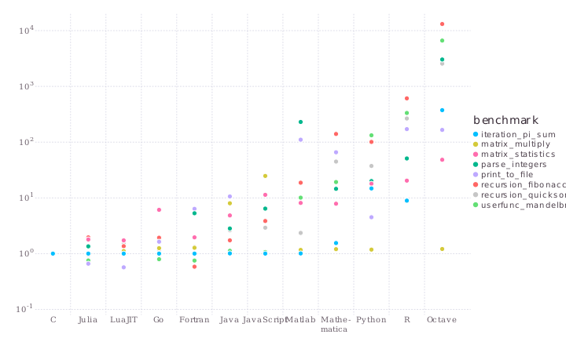

# Εισαγωγή στη γλώσσα Julia

## Στρατής Τσιρτσής
## Τεχνολογία Λογισμικού - 28/2/2018


### Γιατί Julia;

* Γιατί η σύγχρονη καθημερινότητα, δημιουργεί προβλήματα αυξημένης πολυπλοκότητας

* Γιατί η πληροφορική γίνεται, μέρα με τη μέρα, απαραίτητη σε όλους τους επιστημονικούς τομείς

* Γιατί επιστήμονες όπως βιολόγοι, μαθηματικοί, κοινωνιολόγοι, φυσικοί κλπ υλοποιούν προσομοιώσεις μεγάλης υπολογιστικής ισχύος χωρίς να έχουν background μηχανικού

### Ναι, αλλά γιατί Julia;

Γιατί σε σχέση με άλλες γλώσσες προγραμματισμού συνδυάζει όλα τα παρακάτω στοιχεία:
* Σύγχρονη
* Απλή
* Αποδοτική

### Python/R/MATLAB: Συνομιλώντας με το δήμαρχο


* Ασχολείται εκείνος με τα προβλήματά μας για να κάνει τη ζωή μας εύκολότερη

* Του λέμε κάτι και προσπαθεί να μας δώσει αυτό που θέλουμε

* Μπορεί να κάνει κάποια πράγματα στα κρυφά γιατί "έτσι είναι καλύτερα"

* Αποκλείεται να πάρουμε γρήγορη απάντηση

### C/Fortran: Συνομιλώντας με το φιλόσοφο


* Αναφέρουμε ένα πρόβλημα και θέλει να του πούμε ΟΛΕΣ τις λεπτομέρειες

* Ξοδεύουμε ώρες επί ωρών για να ανακαλύψουμε όλες τις πλευρές του προβλήματος

* Όταν καταφέρουμε να του εξηγήσουμε το πρόβλημα όπως ακριβώς θέλει, η συζήτηση μαζί του κοιλά πολύ γρηγορότερα γιατί είναι πανέξυπνος

* Αν θέλουμε να συζητήσουμε μαζί του κάποιο άλλο θέμα, πρέπει να το πιάσουμε πάλι από τα βασικά

### Demo

### Benchmarks


### Ναι, ΑΛΛΑ ΓΙΑΤΙ JULIA;

* Just-In-Time Compilation
* Dynamic Typing
* Type Stability
* Multiple Dispatch

### Just-In-Time Compilation

| Type        | Pre-Runtime                                | Runtime                     |
|-------------|--------------------------------------------|-----------------------------|
| Compiler    | Source Code -> Object Code -> Machine Code |                             |
| Interpreter |                                            | Source Code -> Machine Code |
| JIT Compiler| Source Code -> Byte Code                   | Byte Code -> Machine Code   |

### Dynamic Typing


```julia
function foo(a)
    a+5
end

b=foo(4)
println("b is: ", typeof(b))
b=foo('4')
println("b is: ", typeof(b))
println("foo is: ", typeof(foo))
```

    b is: Int64
    b is: Char
    foo is: #foo


* Οι τύποι δεν δηλώνονται αυστηρά

* Type inference μόνο για λόγους βελτιστοποίησης (Οι συναρτήσεις μπορεί να γραφτούν στο πόδι αλλά "θα παίξει")

* **Haskell/OCaml**: Type <-> Expression (Η συνάρτηση καταλαβαίνει και περιμένει συγκεκριμένους τύπους)
* **Julia**: Type <-> Value (Η συνάρτηση δεν περιμένει τύπους αλλά προσπαθεί να διαχειριστεί τις τιμές)

### Type Stability

* Βασική σχεδιαστική αρχή

* Ορίζουμε τις συναρτήσεις για τιμές εισόδου συγκεκριμένου τύπου ώστε οι τιμές εξόδου να είναι συγκεκριμένου τύπου

* Ουσιαστικά είναι σαν να έχουμε ορίσει στατικά τους τύπους!

* Δυνατότητα compilation optimization ίδια με C!

### Multiple Dispatch

* Δυνατότητα πολυμορφισμού

* Ανάλογα με τον τύπο της εισόδου, εκτελείται διαφορετικός κώδικας για την ίδια συνάρτηση

* **Method overloading (Java)**: Εξαρτάται από το τύπο των μεταβλητών εισόδου (Compile time)
* **Multiple dispatch (Julia)**: Εξαρτάται από τον τύπο των τιμών εισόδου (Runtime)

### DEMO #2

### Multiple Dispatch + Type Stability -> Speed + Readability

* Η συνάρτηση του πολλαπλασιασμού μπορεί να είναι type stable

* Για διαφορετικούς τύπους τιμών εισόδου κάνει διαφορετικά πράγματα λόγω του multiple dispatch

* Γνωρίζοντας ποια "μορφή" της συνάρτησης θα εκτελεστεί, γνωρίζει και τον τύπο της εξόδου

* Ο τύπος αυτός μπορεί να χρησιμοποιηθεί και στη συνέχεια του προγράμματος για περαιτέρω optimization

* Χρειαζόμαστε type stability για να πετύχουμε μεγάλη απόδοση

* Το multiple dispatch είναι απαραίτητο για να κάνουμε τον κώδικα απλούστερο στην εμφάνιση

* **JIT Python != Julia**

### Αναφορές
[1]https://julialang.org/

[2]http://nbviewer.jupyter.org/url/julialang.org/benchmarks/benchmarks.ipynb

[3]https://en.wikipedia.org/wiki/Just-in-time_compilation

[4]https://stackoverflow.com/questions/95635/what-does-a-just-in-time-jit-compiler-do

[5]http://ucidatascienceinitiative.github.io/IntroToJulia/

[6]https://stackoverflow.com/questions/1801216/what-is-the-difference-between-multiple-dispatch-and-method-overloading

# Ερωτήσεις???
